# Análise de Cancelamento de Clientes (Churn) com Python

Projeto de análise de dados que investiga por que uma base de mais de 300 mil clientes apresenta uma alta taxa de cancelamento, identifica os principais fatores por trás disso e estima o impacto de resolvê-los.

## Contexto

Uma empresa com mais de 300 mil clientes percebeu que a maior parte da sua base é composta por clientes inativos, ou seja, que já cancelaram o serviço. O objetivo deste projeto é entender os principais motivos desses cancelamentos e apontar ações que reduzam esse número.

## Tecnologias utilizadas

- Python
- pandas (leitura e tratamento dos dados)
- Plotly Express (visualização gráfica)
- Jupyter Notebook

## Base de dados

Arquivo `cancelamentos_amostra.csv`, com 310.000 linhas e as colunas abaixo:

| Coluna | Descrição |
| --- | --- |
| CustomerID | Identificador do cliente (removido da análise, não traz informação relevante) |
| idade | Idade do cliente |
| sexo | Sexo do cliente |
| tempo_como_cliente | Há quanto tempo a pessoa é cliente |
| frequencia_uso | Frequência de uso do serviço |
| ligacoes_callcenter | Quantidade de ligações feitas ao callcenter |
| dias_atraso | Dias de atraso no pagamento |
| assinatura | Tipo de assinatura (Basic, Standard, Premium) |
| duracao_contrato | Duração do contrato (Monthly, Quarterly, Annual) |
| total_gasto | Total gasto pelo cliente |
| meses_ultima_interacao | Meses desde a última interação do cliente |
| cancelou | Se o cliente cancelou o serviço (1.0) ou não (0.0) |

## Etapas da análise

1. **Leitura dos dados** com `pandas.read_csv`.
2. **Limpeza:**
   - remoção da coluna `CustomerID`, que não ajuda na análise;
   - remoção das linhas com dados vazios (`dropna()`), que representavam uma fração mínima da base.
3. **Análise geral da taxa de cancelamento** com `value_counts(normalize=True)`.
4. **Análise gráfica** de cada coluna da base em relação ao cancelamento, usando histogramas do Plotly (`px.histogram`, colorindo por `cancelou`).
5. **Simulação de melhoria:** aplicação de filtros para remover os três principais problemas encontrados e comparação da taxa de cancelamento antes e depois.

## Principais insights

Ao cruzar cada variável com a coluna `cancelou`, três fatores se destacaram claramente como responsáveis pela maior parte dos cancelamentos:

### 1. Duração do contrato

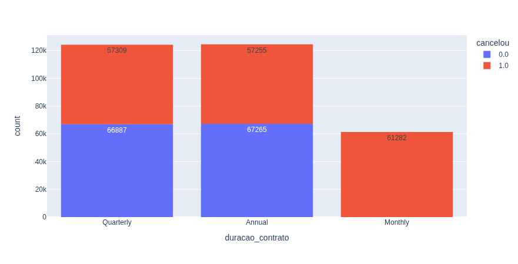

Todos os clientes com contrato mensal cancelaram o serviço. Os contratos trimestral e anual têm uma taxa de cancelamento bem menor e parecida entre si.

**Ação sugerida:** oferecer desconto para migrar clientes do plano mensal para o trimestral ou anual.

### 2. Ligações ao callcenter

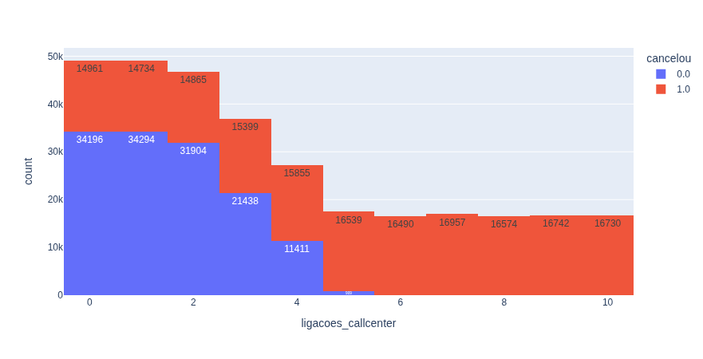

A partir de 5 ligações ao callcenter, praticamente todos os clientes cancelam o serviço.

**Ação sugerida:** tratar 3 ligações como um alerta e agir proativamente antes que o cliente chegue a esse ponto.

### 3. Dias de atraso no pagamento

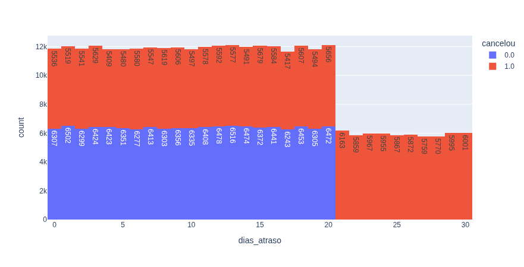

Acima de 20 dias de atraso no pagamento, o cancelamento é praticamente garantido.

**Ação sugerida:** tratar 15 dias de atraso como alerta vermelho.

### Demais variáveis analisadas

As demais colunas da base também foram analisadas graficamente, mas não mostraram um padrão tão claro em relação ao cancelamento:

<table>
<tr>
<td>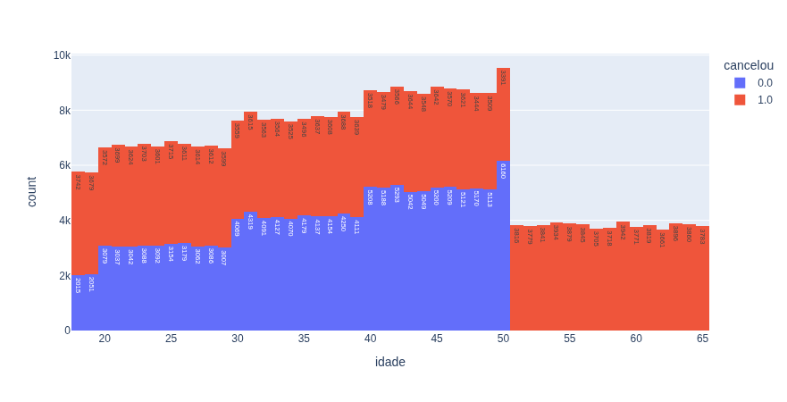</td>
<td>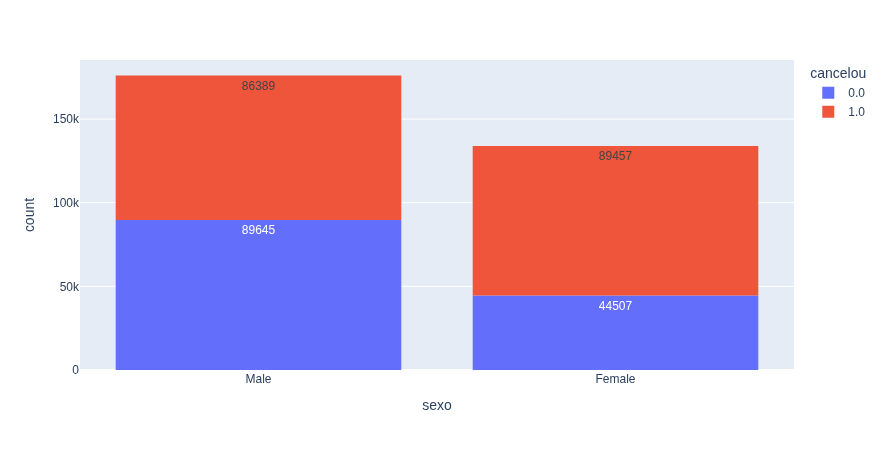</td>
</tr>
<tr>
<td>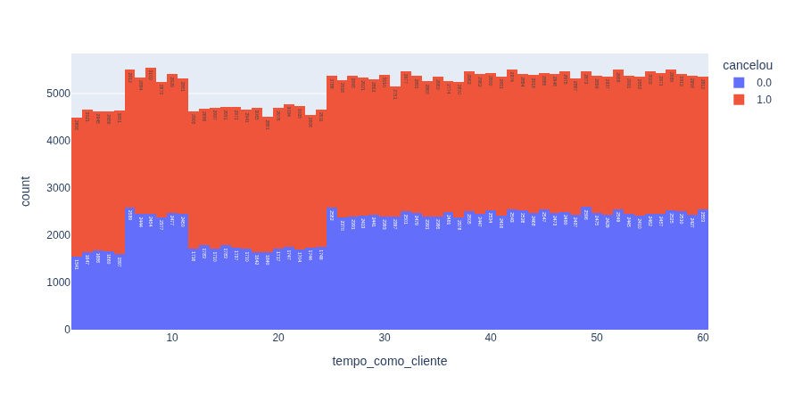</td>
<td>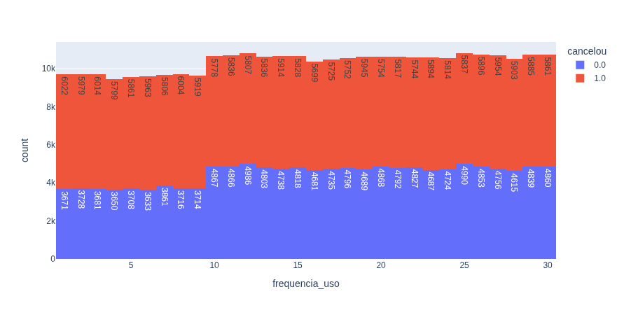</td>
</tr>
<tr>
<td>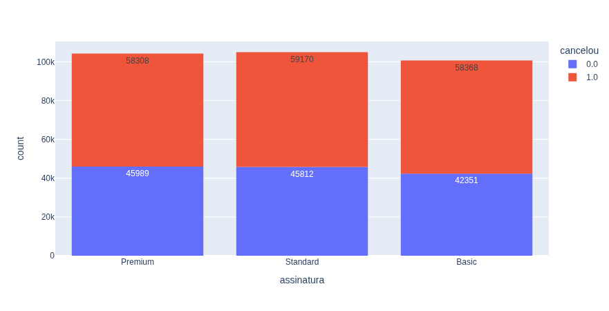</td>
<td>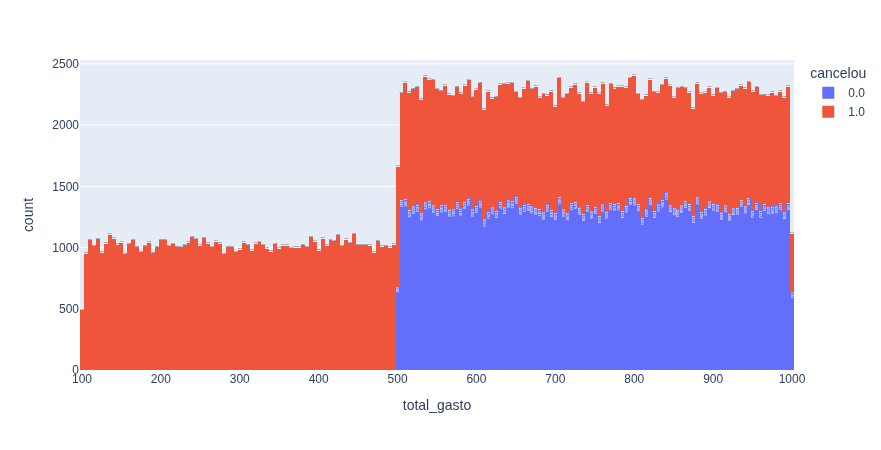</td>
</tr>
<tr>
<td>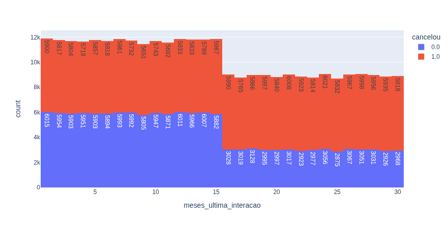</td>
<td>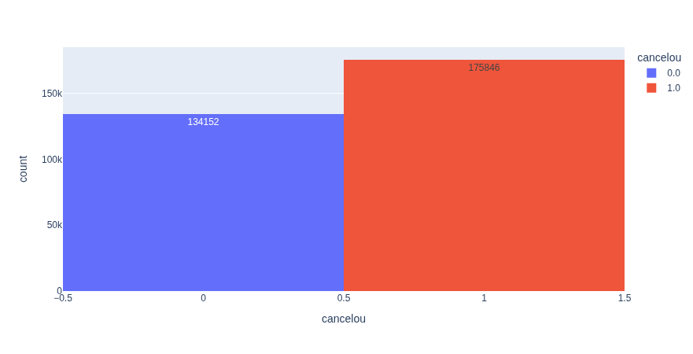</td>
</tr>
</table>

## Resultado da simulação

Depois de identificados os três fatores acima, a base foi filtrada removendo os clientes com contrato mensal, mais de 5 ligações ao callcenter ou mais de 20 dias de atraso, simulando o que aconteceria se esses três problemas fossem resolvidos:

| | Antes | Depois |
| --- | --- | --- |
| Clientes na base | 309.998 | 171.599 |
| Taxa de cancelamento | 56,72% | 21,82% |
| Taxa de retenção | 43,28% | 78,18% |

Resolver esses três problemas reduziria a taxa de cancelamento em mais da metade, de 56,72% para 21,82%.

## Como executar o projeto

```bash
pip install pandas plotly
jupyter notebook inicial.ipynb
```

O notebook espera encontrar o arquivo `cancelamentos_amostra.csv` na mesma pasta.
