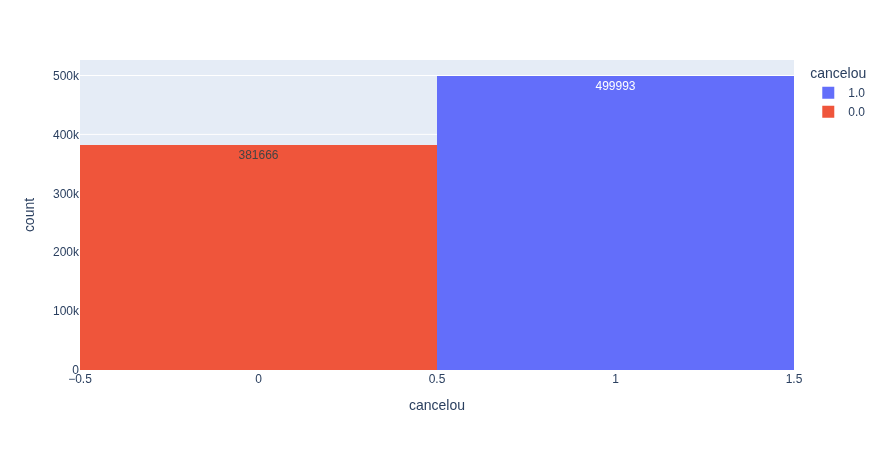
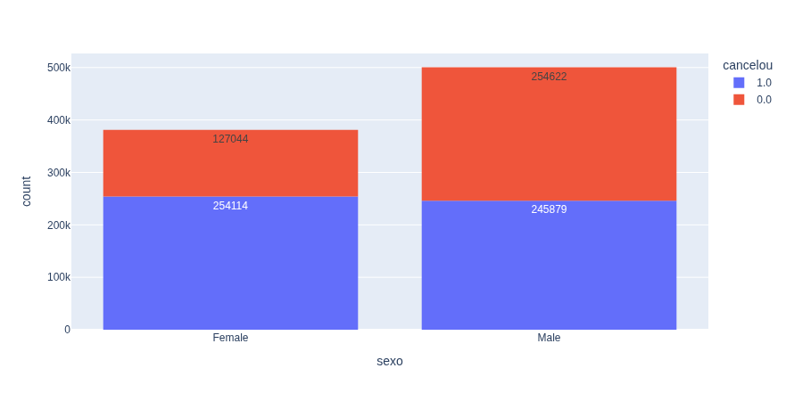
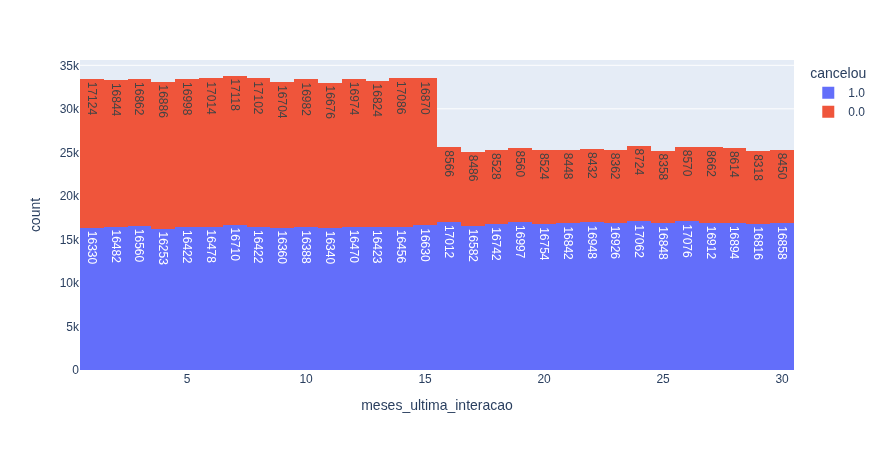
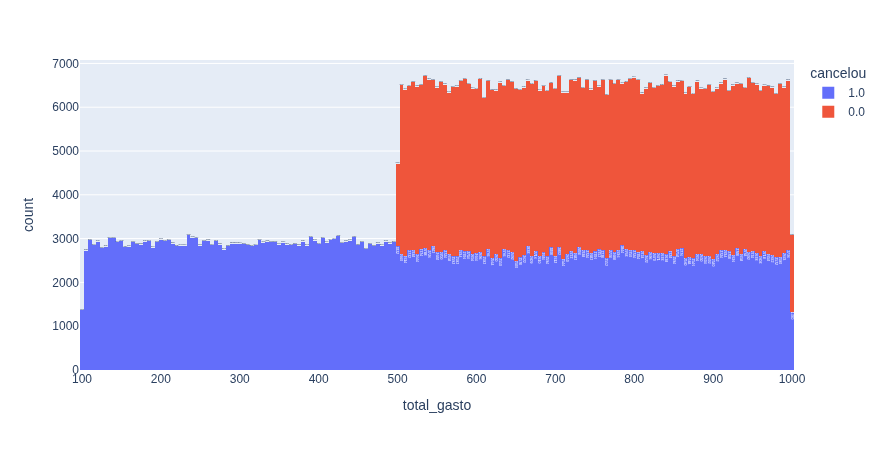
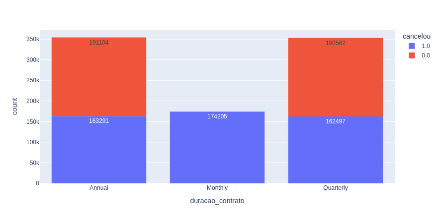
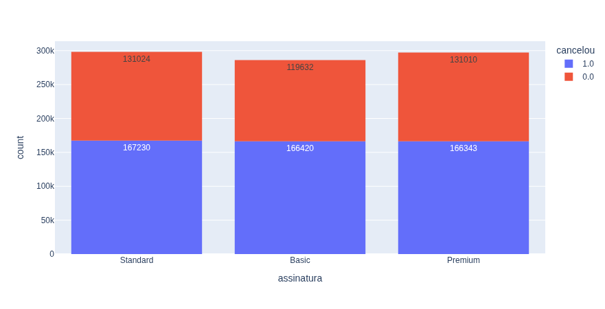
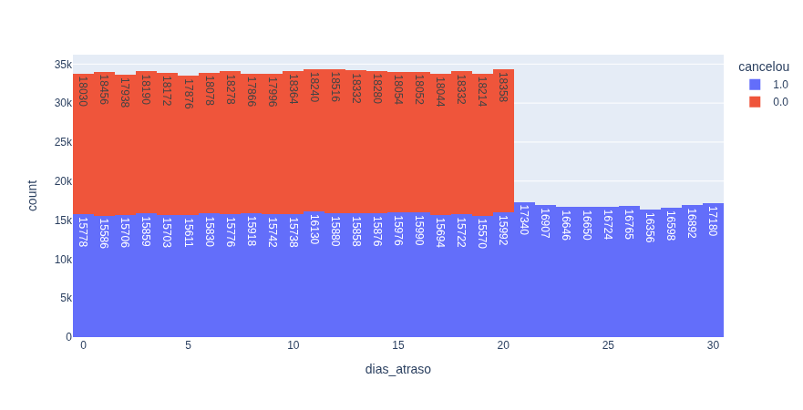
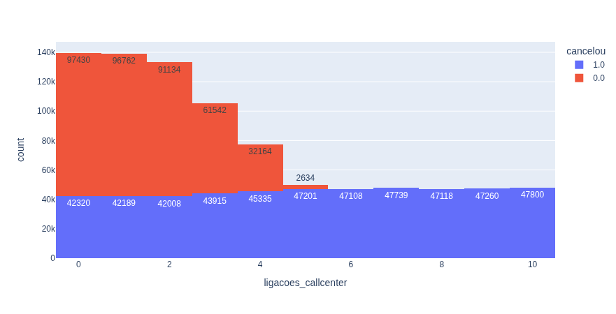
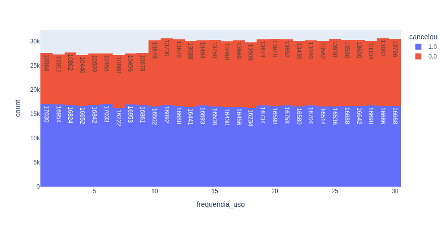
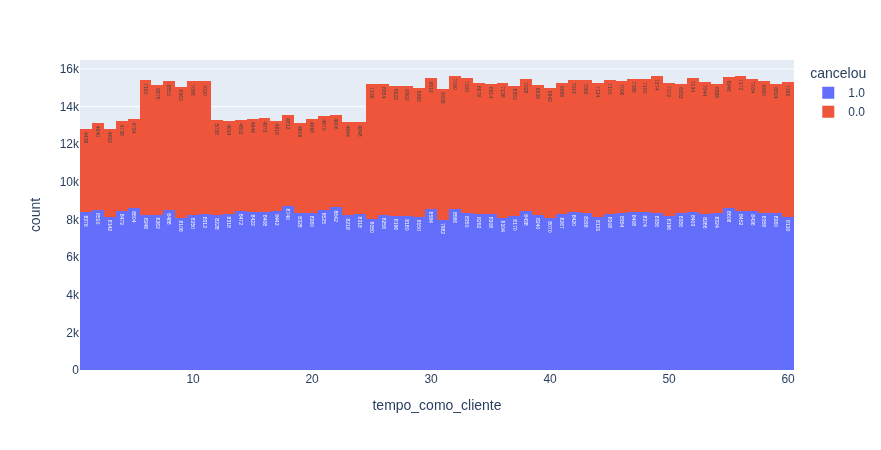

Projeto de análise de dados - Análise de Cancelamento de Clientes

# Análise de Cancelamento de Clientes

## Contexto

Este projeto foi desenvolvido como um estudo prático de análise de dados, com o objetivo de identificar os principais fatores relacionados ao cancelamento de clientes.

A empresa possui uma grande base de clientes e identificou um número elevado de cancelamentos. A partir disso, foi realizada uma análise exploratória para entender os padrões presentes nos dados e identificar possíveis ações para reduzir o churn.

---

## Objetivo

Realizar uma análise exploratória dos dados, incluindo:

* leitura e organização da base de dados;
* tratamento de valores ausentes;
* remoção de informações desnecessárias;
* análise da quantidade de clientes que cancelaram;
* criação de gráficos para identificar padrões;
* identificação dos principais fatores relacionados ao cancelamento;
* simulação de possíveis ações para redução do churn.

---

## Descrição

Análise exploratória de uma base de clientes, utilizando Python, Pandas e Plotly, com foco na identificação de padrões de cancelamento e na geração de insights para possíveis estratégias de retenção.

---

## Resultados

### Cancelamento de clientes



A base analisada possui **881.659 registros**, sendo **499.993 clientes que cancelaram** e **381.666 clientes que não cancelaram**.

Isso representa aproximadamente **56,7% de cancelamentos** na base analisada.

---

### Sexo



A quantidade de cancelamentos entre homens e mulheres apresenta valores bastante próximos.

Dessa forma, o sexo não apresenta uma diferença significativa no comportamento de cancelamento observado nesta análise.

---

### Meses desde a última interação



A distribuição dos clientes em relação aos meses desde a última interação apresenta diferenças entre os grupos, porém não demonstra um padrão tão evidente quanto os fatores relacionados ao contrato, atendimento e atraso.

---

### Total gasto



A variável de gasto total apresenta diferenças entre clientes cancelados e não cancelados, mas não mostra um padrão tão evidente de separação entre os grupos.

---

### Duração do contrato



Este foi um dos principais padrões encontrados na análise.

Os clientes com contrato **Monthly** aparecem exclusivamente no grupo de cancelamento, enquanto os contratos **Annual** e **Quarterly** possuem clientes cancelados e não cancelados.

Isso indica uma forte relação entre o contrato mensal e o cancelamento.

---

### Tipo de assinatura



As categorias **Standard**, **Basic** e **Premium** apresentam distribuições relativamente semelhantes entre clientes cancelados e não cancelados.

Portanto, o tipo de assinatura não apresenta um padrão tão forte de diferenciação quanto a duração do contrato.

---

### Dias de atraso



Os dias de atraso apresentam um dos padrões mais relevantes da análise.

Até aproximadamente **20 dias de atraso**, ainda existem clientes nos dois grupos. A partir de **21 dias**, os clientes cancelados passam a predominar.

Isso indica uma forte associação entre atrasos elevados e cancelamento.

---

### Ligações ao Call Center



A quantidade de ligações para o Call Center apresenta uma diferença bastante clara entre os grupos.

Até **4 ligações**, ainda existem muitos clientes que não cancelaram. A partir de **5 ligações**, os cancelamentos passam a predominar fortemente.

Esse comportamento sugere que o número de ligações pode ser utilizado como um indicador de risco de churn.

---

### Frequência de uso



A frequência de uso apresenta bastante sobreposição entre os clientes cancelados e não cancelados.

Não foi identificado um ponto de separação tão evidente quanto nos casos de duração do contrato, dias de atraso e ligações ao Call Center.

---

### Tempo como cliente



O tempo como cliente também apresenta uma distribuição relativamente semelhante entre os dois grupos.

Apesar de existirem algumas diferenças, não foi identificado um padrão tão evidente quanto nos principais fatores encontrados.

---

### Idade

.png)

A idade apresenta diferenças na distribuição dos grupos, porém não demonstra um padrão de separação tão claro quanto os principais fatores relacionados ao churn.

---

## Principais Insights

- **Contrato mensal:** clientes com contrato `Monthly` apresentam uma forte associação com o cancelamento. Uma possível estratégia seria incentivar a migração para contratos de maior duração.

- **Ligações ao Call Center:** a partir de aproximadamente **5 ligações**, os clientes cancelados passam a predominar. O número de contatos pode ser utilizado como um sinal de alerta para retenção.

- **Dias de atraso:** após aproximadamente **20 dias de atraso**, os cancelamentos passam a predominar fortemente. A empresa poderia criar ações preventivas antes que o atraso ultrapasse esse período.

- **Demais variáveis:** sexo, tipo de assinatura, frequência de uso, tempo como cliente, idade e total gasto apresentaram diferenças, mas não mostraram padrões tão claros quanto os três fatores principais.

---

## Simulação de Redução do Churn

Após identificar os principais fatores relacionados ao cancelamento, foi realizada uma simulação considerando três situações:

* clientes com contrato mensal;
* clientes com mais de 4 ligações para o Call Center;
* clientes com mais de 20 dias de atraso.

Os filtros utilizados foram:

```python
condicao = tabela["duracao_contrato"] != "Monthly"
tabela = tabela[condicao]

condicao = tabela["ligacoes_callcenter"] <= 4
tabela = tabela[condicao]

condicao = tabela["dias_atraso"] <= 20
tabela = tabela[condicao]
```

Após a aplicação dos filtros, a taxa de cancelamento foi calculada novamente para observar como a distribuição dos clientes poderia mudar.

Essa etapa representa uma **simulação baseada nos dados**, não uma previsão de que essas ações necessariamente produzirão o mesmo resultado em um cenário real.

---

## Estrutura do Projeto

- `cancelamentos_amostra.csv` — base de dados utilizada na análise
- `inicial.ipynb` — notebook com o processamento e análise dos dados
- `README.md` — documentação do projeto
- `newplot.png` — gráfico de cancelamento por sexo
- `newplot01.png` — gráfico de cancelamento por tempo como cliente
- `newplot02.png` — gráfico de cancelamento por frequência de uso
- `newplot03.png` — gráfico de cancelamento por ligações ao Call Center
- `newplot04.png` — gráfico de cancelamento por dias de atraso
- `newplot05.png` — gráfico de cancelamento por tipo de assinatura
- `newplot06.png` — gráfico de cancelamento por duração do contrato
- `newplot07.png` — gráfico de cancelamento por total gasto
- `newplot08.png` — gráfico de cancelamento por meses desde a última interação
- `newplot09.png` — gráfico geral de cancelamentos
- `newplot(1).png` — gráfico de cancelamento por idade

---

## Tecnologias Utilizadas

- Python 3
- Pandas
- Plotly Express
- Jupyter Notebook

---

## Etapas Realizadas

### 1. Leitura dos dados

A base foi carregada a partir do arquivo `cancelamentos_amostra.csv` utilizando a biblioteca `pandas`.

```python
tabela = pandas.read_csv("cancelamentos_amostra.csv")
```

### 2. Limpeza dos dados

Foi removida a coluna `CustomerID`, por não ser relevante para a análise.

```python
tabela = tabela.drop(columns="CustomerID")
```

Também foram removidas linhas com valores ausentes:

```python
tabela = tabela.dropna()
```

### 3. Análise dos cancelamentos

A coluna `cancelou` foi utilizada como variável principal da análise:

- `1.0` → cliente que cancelou;
- `0.0` → cliente que não cancelou.

A quantidade de clientes foi obtida utilizando:

```python
tabela["cancelou"].value_counts()
```

E a proporção:

```python
tabela["cancelou"].value_counts(normalize=True)
```

### 4. Visualização dos dados

Foram utilizados gráficos do **Plotly Express** para comparar o cancelamento com as diferentes variáveis da base.

A geração dos gráficos foi automatizada através de um loop:

```python
for coluna in tabela.columns:
    grafico = px.histogram(
        tabela,
        x=coluna,
        color="cancelou",
        text_auto="True"
    )

    grafico.show()
```

### 5. Identificação dos principais fatores

Após analisar os gráficos, foram identificados três fatores com padrões mais evidentes:

- duração do contrato;
- ligações ao Call Center;
- dias de atraso.

### 6. Simulação

Por fim, foram aplicados filtros para simular como a taxa de cancelamento poderia se comportar caso esses fatores fossem reduzidos.

---

## Base de Dados

O projeto utiliza o arquivo `cancelamentos_amostra.csv`, contendo centenas de milhares de registros de clientes.

A base foi utilizada para realizar a análise exploratória e identificar padrões relacionados ao cancelamento.

---

## Como Executar

1. Instale as dependências:

```bash
pip install pandas plotly
```

2. Abra o notebook:

```bash
jupyter notebook inicial.ipynb
```

3. Execute as células em ordem ou utilize a opção **Run All**.
